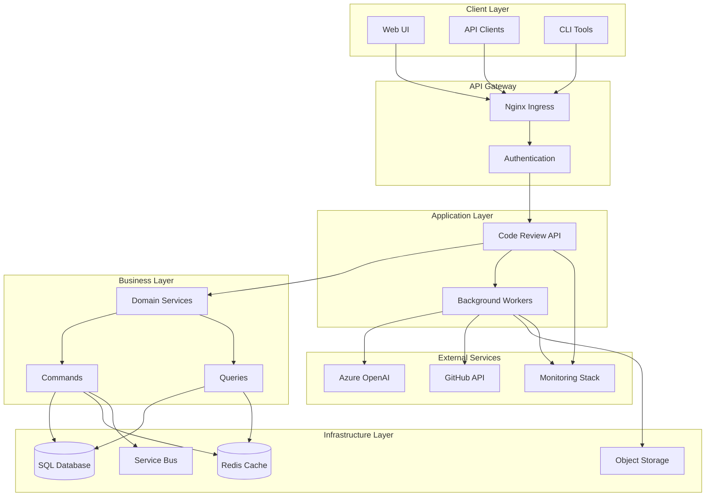
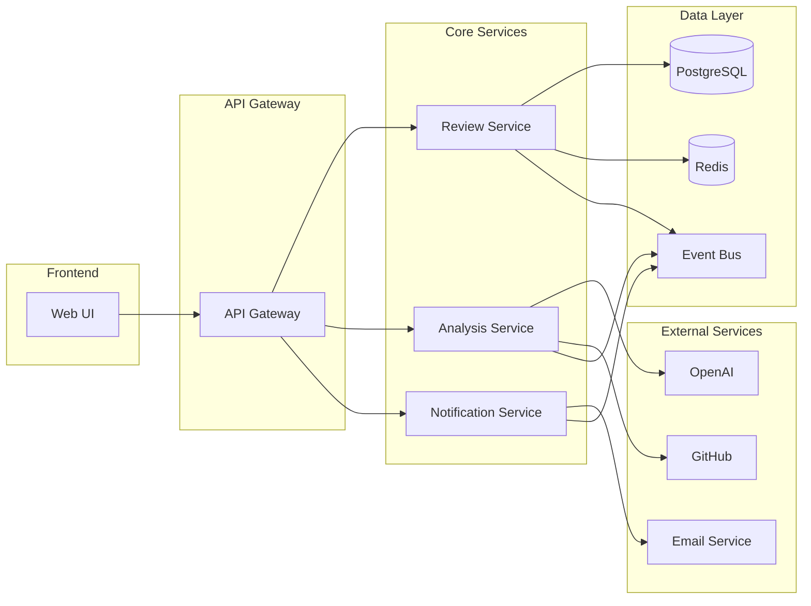
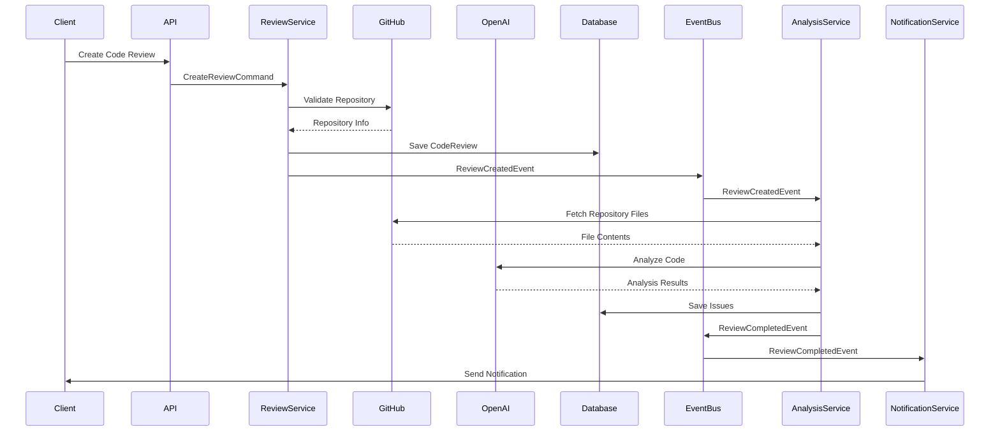
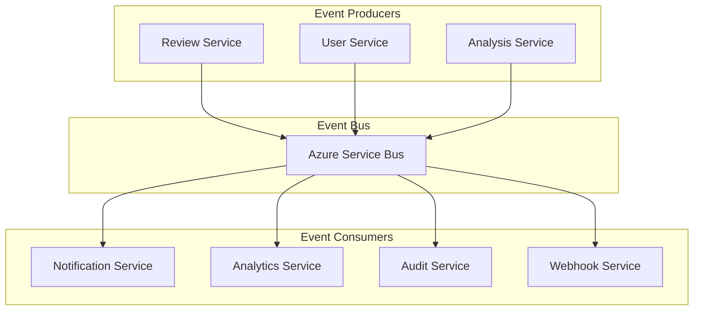
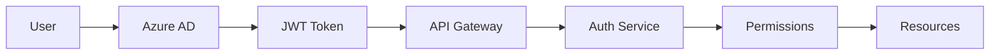
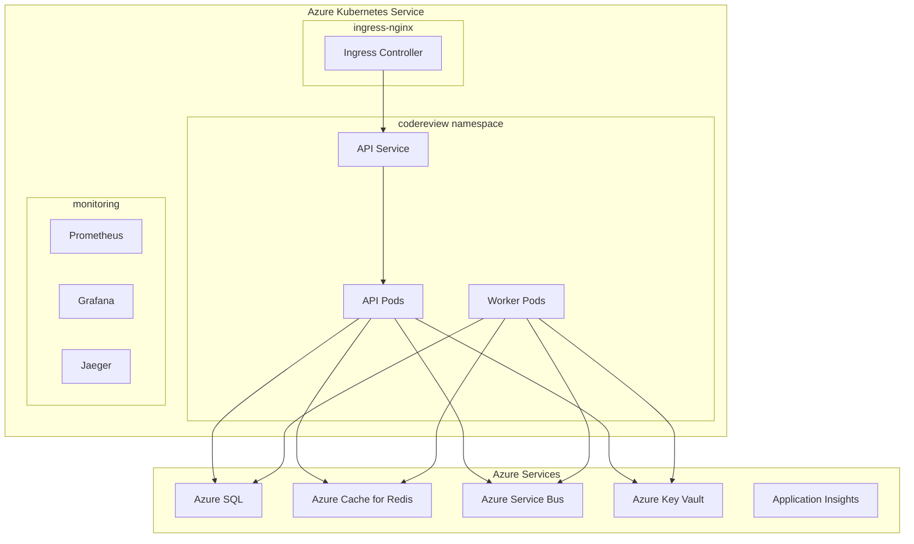

# Code Review Assistant Architecture

## Overview

The Code Review Assistant is a cloud-native, AI-powered application that provides automated code analysis and review capabilities. Built on .NET 8 with a clean architecture pattern, it integrates with Azure OpenAI for intelligent code analysis and provides comprehensive review insights.

## Architecture Diagrams

### High-Level Architecture

### Microservices Architecture

## System Components

### 1. API Layer
- **Web API**: RESTful API built with ASP.NET Core 8
- **Authentication**: Azure AD integration with JWT tokens
- **Authorization**: Role-based access control
- **Rate Limiting**: Configurable rate limiting per client
- **CORS**: Cross-origin resource sharing configuration

### 2. Application Layer
- **CQRS Pattern**: Command Query Responsibility Segregation
- **MediatR**: Mediator pattern for command/query handling
- **Validation**: FluentValidation for request validation
- **Mapping**: AutoMapper for object mapping
- **Events**: Domain events for loose coupling

### 3. Domain Layer
- **Entities**: Core business entities (CodeReview, ReviewIssue, etc.)
- **Value Objects**: Immutable value objects (GitHubRepository, etc.)
- **Aggregates**: Aggregate roots with business logic
- **Domain Events**: Events for domain state changes
- **Specifications**: Business rule specifications

### 4. Infrastructure Layer
- **Persistence**: Entity Framework Core with SQL Server
- **Caching**: Redis distributed caching
- **Messaging**: Azure Service Bus for event handling
- **External Services**: GitHub API, Azure OpenAI integration
- **Logging**: Serilog with structured logging

### 5. Cross-Cutting Concerns
- **Security**: Authentication, authorization, encryption
- **Monitoring**: OpenTelemetry, Prometheus, Grafana
- **Health Checks**: ASP.NET Core health checks
- **Exception Handling**: Global exception handling middleware
- **Configuration**: Azure Key Vault integration

## Data Flow

### Code Review Process Flow

### Event-Driven Architecture

## Security Architecture

### Authentication & Authorization

### Security Layers

1. **Network Security**
   - VNet isolation
   - Network Security Groups
   - Private endpoints
   - DDoS protection

2. **Application Security**
   - Azure AD authentication
   - Role-based authorization
   - API key management
   - Input validation

3. **Data Security**
   - Encryption at rest
   - Encryption in transit
   - Key Vault integration
   - Data masking

4. **Infrastructure Security**
   - Managed identities
   - Least privilege access
   - Security monitoring
   - Vulnerability scanning

## Deployment Architecture

### Kubernetes Deployment

### Environment Architecture

| Environment | Purpose | Resources | Scaling |
|-------------|---------|-----------|---------|
| Development | Local development | Single node, local services | Manual |
| Staging | Pre-production testing | Production-like setup | Auto-scaling |
| Production | Live service | High availability, multi-zone | Auto-scaling |

## Technology Stack

### Backend Technologies
- **.NET 8**: Primary development platform
- **ASP.NET Core**: Web framework
- **Entity Framework Core**: ORM
- **MediatR**: Mediator pattern
- **AutoMapper**: Object mapping
- **FluentValidation**: Validation
- **Serilog**: Logging
- **xUnit**: Testing framework

### Infrastructure Technologies
- **Azure Kubernetes Service**: Container orchestration
- **Azure SQL Database**: Primary database
- **Azure Cache for Redis**: Caching
- **Azure Service Bus**: Messaging
- **Azure Key Vault**: Secrets management
- **Azure Container Registry**: Container registry
- **Azure Application Insights**: Monitoring

### DevOps Technologies
- **Docker**: Containerization
- **Helm**: Package management
- **Terraform**: Infrastructure as code
- **GitHub Actions**: CI/CD pipeline
- **Prometheus**: Metrics collection
- **Grafana**: Visualization
- **Jaeger**: Distributed tracing

## Quality Attributes

### Performance
- **Response Time**: < 200ms for API calls
- **Throughput**: 1000+ requests/second
- **Scalability**: Horizontal scaling with HPA
- **Caching**: Multi-layer caching strategy

### Reliability
- **Availability**: 99.9% uptime SLA
- **Fault Tolerance**: Circuit breakers, retries
- **Disaster Recovery**: Multi-region deployment
- **Backup Strategy**: Automated backups

### Security
- **Authentication**: Azure AD integration
- **Authorization**: RBAC with fine-grained permissions
- **Data Protection**: Encryption at rest and in transit
- **Compliance**: GDPR, SOC 2 compliance

### Maintainability
- **Code Quality**: Clean architecture principles
- **Testing**: 80%+ code coverage
- **Documentation**: Comprehensive API docs
- **Monitoring**: Full observability stack

### Scalability
- **Horizontal Scaling**: Pod autoscaling
- **Database Scaling**: Read replicas, sharding
- **Caching Scale**: Distributed Redis cluster
- **Message Queue Scale**: Partitioned topics

## Decision Records

### ADR-001: Choose .NET 8
- **Decision**: Use .NET 8 as the primary development platform
- **Status**: Accepted
- **Consequences**: Modern features, performance improvements, long-term support

### ADR-002: Use Azure OpenAI
- **Decision**: Integrate Azure OpenAI for code analysis
- **Status**: Accepted
- **Consequences**: Enterprise-grade AI, data privacy, cost management

### ADR-003: Implement CQRS Pattern
- **Decision**: Use CQRS for command/query separation
- **Status**: Accepted
- **Consequences**: Better scalability, complexity management

### ADR-004: Use Event-Driven Architecture
- **Decision**: Implement event-driven communication
- **Status**: Accepted
- **Consequences**: Loose coupling, eventual consistency

### ADR-005: Deploy to Kubernetes
- **Decision**: Use AKS for container orchestration
- **Status**: Accepted
- **Consequences**: Cloud-native, scalability, portability

## Future Considerations

### Scalability Enhancements
- Implement database sharding
- Add CDN for static assets
- Implement API versioning strategy
- Add rate limiting per user

### Feature Enhancements
- Multi-language support
- Custom rule engine
- Integration with more code repositories
- Advanced analytics dashboard

### Operational Improvements
- Automated disaster recovery testing
- Performance optimization
- Cost optimization
- Enhanced monitoring and alerting
