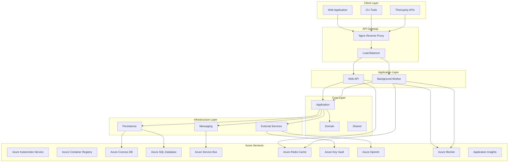
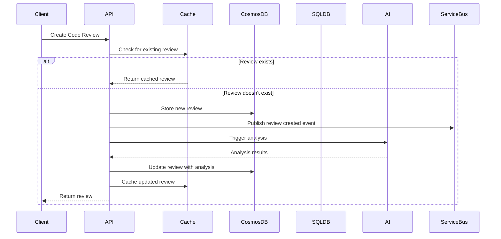

# Architecture Documentation

## Overview

The AI-Powered Code Review Assistant follows Clean Architecture principles with domain-driven design (DDD) patterns. The system is designed to be scalable, maintainable, and cloud-native, leveraging Microsoft Azure services for optimal performance and reliability.

## High-Level Architecture

## Clean Architecture Layers

### Domain Layer
- **Purpose**: Core business logic and domain models
- **Components**: Entities, Value Objects, Domain Events, Domain Services
- **Dependencies**: None (pure .NET)

### Application Layer
- **Purpose**: Application use cases and orchestration
- **Components**: Commands, Queries, DTOs, Validators, Handlers
- **Dependencies**: Domain Layer

### Infrastructure Layer
- **Purpose**: External concerns and data access
- **Components**: Database, External APIs, Messaging, Caching
- **Dependencies**: Application Layer

### Presentation Layer
- **Purpose**: User interface and API endpoints
- **Components**: Web API, Background Worker, CLI Tools
- **Dependencies**: Application Layer

## Technology Stack

### Core Technologies
- **.NET 10**: Latest framework with C# 13
- **ASP.NET Core**: Web framework for APIs
- **Entity Framework Core**: ORM for data access
- **MediatR**: CQRS pattern implementation
- **AutoMapper**: Object mapping
- **FluentValidation**: Input validation

### Azure Services
- **Azure Kubernetes Service (AKS)**: Container orchestration
- **Azure Container Registry**: Docker image storage
- **Azure Cosmos DB**: NoSQL database for high performance
- **Azure SQL Database**: Relational database for structured data
- **Azure Service Bus**: Message queuing and pub/sub
- **Azure Redis Cache**: Distributed caching
- **Azure Key Vault**: Secret management
- **Azure OpenAI**: AI/ML capabilities
- **Azure Monitor**: Monitoring and alerting
- **Application Insights**: Application performance monitoring

### Development Tools
- **Docker**: Containerization
- **Kubernetes**: Container orchestration
- **Helm**: Kubernetes package management
- **Terraform**: Infrastructure as code
- **GitHub Actions**: CI/CD pipelines
- **OpenTelemetry**: Observability

## Data Architecture

### Data Storage Strategy

#### Azure Cosmos DB
- **Purpose**: High-performance NoSQL storage
- **Use Cases**: Code reviews, AI analyses, audit logs
- **Consistency**: Session consistency for performance
- **Partitioning**: By repository and date

#### Azure SQL Database
- **Purpose**: Relational data with ACID compliance
- **Use Cases**: User management, configuration, reporting
- **Performance**: Optimized with proper indexing
- **Scaling**: Read replicas for read-heavy workloads

#### Azure Redis Cache
- **Purpose**: Distributed caching layer
- **Use Cases**: API responses, session data, frequently accessed data
- **Strategy**: Cache-aside pattern
- **Eviction**: LRU with TTL

### Data Flow

## Security Architecture

### Authentication & Authorization
- **Azure AD**: Identity and access management
- **OAuth 2.0**: Standard authentication protocol
- **JWT Tokens**: Bearer token authentication
- **Role-Based Access Control (RBAC)**: Fine-grained permissions
- **API Keys**: Service-to-service authentication

### Security Controls
- **OWASP Top 10**: Comprehensive security controls
- **Input Validation**: Prevent injection attacks
- **Rate Limiting**: Prevent abuse and DoS
- **Security Headers**: XSS, CSRF, clickjacking protection
- **Encryption**: Data in transit and at rest
- **Audit Logging**: Complete audit trail

### Network Security
- **Virtual Networks**: Isolated network segments
- **Network Security Groups**: Traffic filtering
- **Private Endpoints**: Secure Azure service access
- **DDoS Protection**: Azure DDoS protection
- **WAF**: Web Application Firewall

## Performance Architecture

### Scalability Strategy
- **Horizontal Scaling**: Auto-scaling based on metrics
- **Load Balancing**: Distribute traffic efficiently
- **Caching**: Multi-level caching strategy
- **Database Optimization**: Proper indexing and partitioning
- **CDN**: Static content delivery

### Performance Monitoring
- **Application Metrics**: Custom business metrics
- **Infrastructure Metrics**: CPU, memory, network
- **Database Performance**: Query performance, connection pools
- **User Experience**: Response times, error rates
- **AI Performance**: Model latency, token usage

## Deployment Architecture

### Container Strategy
- **Multi-stage Dockerfiles**: Optimized production images
- **Security Hardening**: Non-root users, minimal attack surface
- **Health Checks**: Liveness and readiness probes
- **Resource Limits**: Memory and CPU constraints

### Kubernetes Deployment
- **Namespaces**: Environment isolation
- **Resource Quotas**: Fair resource allocation
- **Network Policies**: Traffic control
- **Pod Security Policies**: Security enforcement
- **Helm Charts**: templated deployments

### CI/CD Pipeline
- **GitHub Actions**: Automated workflows
- **Security Scanning**: Vulnerability detection
- **Automated Testing**: Unit, integration, E2E
- **Multi-Environment**: Dev, staging, production
- **Rollback Strategy**: Safe deployment practices

## Integration Patterns

### External Integrations
- **GitHub**: Pull request webhooks and API
- **Azure DevOps**: Work item integration
- **Slack/Teams**: Notifications and alerts
- **Jira**: Issue tracking integration
- **SonarQube**: Code quality metrics

### Message Patterns
- **Event-Driven**: Decoupled architecture
- **Command/Query Separation**: CQRS pattern
- **Saga Pattern**: Distributed transactions
- **Dead Letter Queues**: Error handling
- **Retry Patterns**: Resilient messaging

## Monitoring & Observability

### Logging Strategy
- **Structured Logging**: JSON format for analysis
- **Log Levels**: Appropriate verbosity
- **Correlation IDs**: Request tracing
- **Sensitive Data**: Redaction and masking
- **Log Aggregation**: Centralized collection

### Metrics Collection
- **OpenTelemetry**: Industry standard
- **Custom Metrics**: Business KPIs
- **Resource Metrics**: Infrastructure health
- **Performance Metrics**: Application performance
- **Error Metrics**: Failure analysis

### Distributed Tracing
- **Request Tracing**: End-to-end visibility
- **Service Dependencies**: Map interactions
- **Performance Bottlenecks**: Identify issues
- **Root Cause Analysis**: Debug failures

## Architecture Decisions

### Key Design Decisions

1. **Clean Architecture**: Maintainable and testable code
2. **Microservices**: Scalable and resilient services
3. **Event-Driven**: Loose coupling and scalability
4. **Cloud-Native**: Leverage Azure services
5. **Security-First**: Comprehensive security controls

### Trade-offs Considered

1. **Performance vs. Consistency**: Chose eventual consistency for scalability
2. **Complexity vs. Features**: Balanced feature set with maintainability
3. **Cost vs. Performance**: Optimized for cost-effective performance
4. **Security vs. Usability**: Secure without impacting user experience

## Future Considerations

### Scalability Enhancements
- **Global Deployment**: Multi-region deployment
- **Edge Computing**: Reduce latency
- **Serverless Components**: Cost optimization
- **Advanced Caching**: Multi-tier caching

### Technology Evolution
- **.NET Updates**: Stay current with latest framework
- **AI Model Updates**: Latest AI capabilities
- **Azure Services**: New service integration
- **Security Enhancements**: Continuous improvement

This architecture provides a solid foundation for the AI-Powered Code Review Assistant while ensuring scalability, security, and maintainability.
